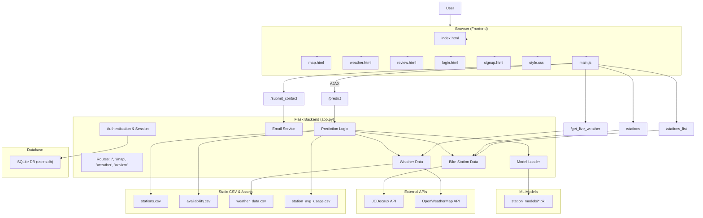
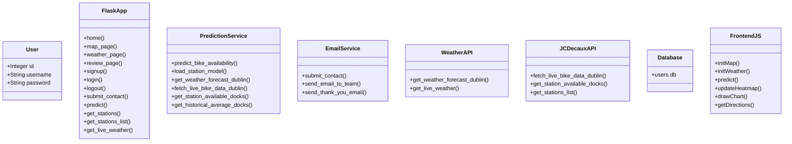

# Dublin Bikes 

This project is a comprehensive Flask-based web application that predicts the availability of Dublin Bikes at various stations using machine learning. It integrates real-time weather data, live bike station data, and historical CSV records to help users plan better.

---

## Key Features

- **User Authentication**: Signup, login, logout with secure password hashing.
- **Interactive Map**: Bike stations visualized on OpenStreetMap with heatmaps, satellite toggle, routing.
- **Bike Availability Prediction**: ML model for each station predicts bike availability based on weather, time, and station data.
- **Weather Forecast and Live Widget**: Uses OpenWeatherMap API for live weather data.
- **Contact Form with Email Notifications**: Sends confirmation and support emails.
- **Historical Data Charts**: Weather and bike trends visualized from CSV files.

---

## Project Structure

```
Dublin final version/
│
├── app.py                        # Main Flask application
├── requirements.txt              # Python dependencies
├── .env                          # Environment variables (API keys, secrets)
├── templates/                    # HTML pages (Jinja templates)
│   ├── index.html
│   ├── map.html
│   ├── weather.html
│   ├── review.html
│   ├── login.html
│   └── signup.html
├── static/                       # CSS, JS, images, and CSV data
│   ├── style.css
│   ├── main.js
│   ├── stations.csv
│   ├── availability.csv
│   ├── weather_data.csv
│   ├── station_avg_usage.csv
│   └── bike.png
├── station_models/              # ML models (.pkl) per station
│   └── station_*.pkl
├── tests/                        # Unit testing scripts
│   ├── test_app.py
│   ├── test_email.py
│   ├── test_js_logic.py
│   └── unit_tests.py
└── .gitignore                    # Files to ignore in git
```

---

## System Architecture (Mermaid Diagram)



---

## Class Overview

```python
# User Model
class User(db.Model):
    id = db.Column(db.Integer, primary_key=True)
    username = db.Column(db.String(80), unique=True, nullable=False)
    password = db.Column(db.String(200), nullable=False)
```

- Flask's `SQLAlchemy` is used for ORM.
- User login, signup, and session management handled via secure cookies.
- `@login_required` decorator ensures access control.

---

## Testing

Located in `/tests`:
- `test_app.py`: Backend logic and route tests.
- `test_email.py`: SMTP email sending validation.
- `test_js_logic.py`: JS logic testing.
- `unit_tests.py`: General unit tests for helper functions.

Run tests using:
```bash
pytest tests/
```

---

## Setup & Run

### 1. Clone and install dependencies
```bash
pip install -r requirements.txt
```

### 2. Setup environment variables in `.env`
```
FLASK_SECRET_KEY=your_secret_key
EMAIL_ADDRESS=your_email
EMAIL_PASSWORD=your_email_password
OPENWEATHERMAP_API_KEY=your_api_key
JCDECAUX_API_KEY=your_jcdecaux_key
```

### 3. Run the application
```bash
python app.py
```

Open browser at `http://127.0.0.1:5000`

---


---

## Class Diagram



---

##  Additional Features

-  **Routing Between Stations**: Users can choose start and end stations and get bike-friendly directions.
-  **Custom Station Selector**: Enhanced dropdown with autocomplete for better UX.
-  **Modular Code**: Flask routes, services, and prediction logic are cleanly separated.
-  **Configurable with `.env`**: Easily switch API keys and secret values.
-  **Dynamic Charts**: Renders charts on-the-fly based on CSV updates.


